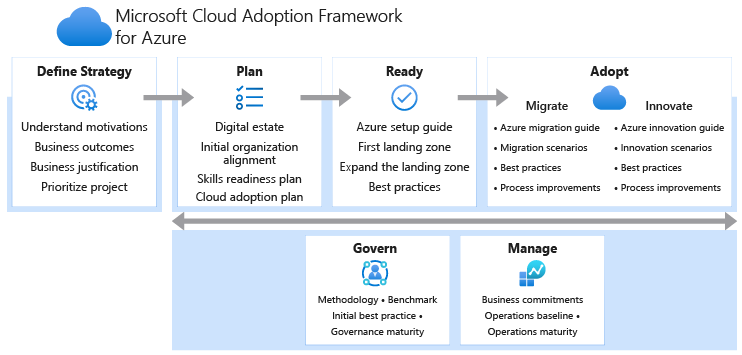

# Microsoft Azure Cloud Adoption Framework

In deze markdown page wordt het Azure Cloud Adoption Framework behandeld. Hierin is te lezen wat voor soort framework het is, wat het inhoudt, hoe dit framework bijdraagt aan governance met de aspecten die worden afgedekt, de sterke en minder sterke punten en als laatst hoe andere Cloud providers met dit framework omgaan.

## Microsoft Cloud Adoption Framework video

https://www.youtube.com/watch?v=3g4JYwxz-cE

## Inhoud

* [Wat voor standaard/framework is dit?](standaard-framework)
* [Hoe draagt dit framework bij aan governance?](bijdrage)
* [Worden alle governance aspecten afgedekt?](aspecten)
* [Sterke en minder sterke punten](sterkepunten)
* [Conformeren de grote providers zich aan dit framework?](providers)
* [Bronnen](bronnen)

## Wat voor standaard/framework is dit?

De Microsoft Cloud Adoption Framework is een verzameling van documentatie die helpt bij het implementeren van Cloud technologieën, business, processen en de mensen. De informatie over implementatie in dit framework is gebaseerd op de best-practices van Azure en ervaringen van Azure. Met het gebruik van dit framework kunnen bedrijven op de best mogelijke manier hun mensen, processen en technologieën implementeren in Azure.
Het framework bestaat uit verschillende fases voordat uiteindelijk alles kan worden geïmplementeerd. De vier fases zijn: De strategie bepalen, plannen, gereed maken en uiteindelijk adopteren. Deze fases worden ondersteund door methodes die de governance en het managen van alle fases en processen mogelijk maakt. 

Fase 1 is de strategie fase, hierin moet worden nagegaan door het bedrijf waarom ze naar de Cloud gaan en welke strategie ze hiervoor gebruiken, deze zaken moeten ook met de stakeholders worden besproken. Fase 2 is de plan fase. Hierin wordt behulp van het framework een plan opgesteld op basis van de gekozen strategie. Hier wordt ook bepaald welke technologieën worden gebruikt in de Cloud.
Fase 3 is de ‘gereed’ fase, bij deze fase wordt er een landingszone opgesteld voor het implementeren van de workloads die naar de Cloud gaan. Het framework helpt bij het maken van een landingszone voor de workloads. De laatste fase is de adopteer fase, hierin worden zaken als migratie en innovatie geregeld. Bij het migreren wordt er gekeken wat de beste manier is om workloads naar de Cloud te brengen. Bij de innovatiefase wordt er gekeken naar IT-portfolio’s en of deze innovatieve ideeen bevatten voor bijvoorbeeld nieuwe technische vaardigheden of zakelijke mogelijkheden. 

## Hoe draagt dit framework bij aan governance?

## Worden alle governance aspecten afgedekt?

## Sterke en minder sterke punten

## Conformeren de grote providers zich aan dit framework?

## Bronnen
* https://docs.microsoft.com/nl-nl/azure/cloud-adoption-framework/